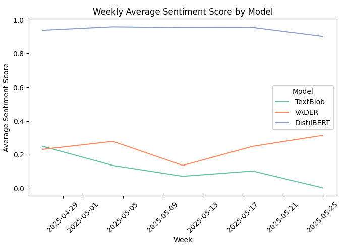

<h1>News Sentiment Analysis Using Multiple NLP Models</h1>

<h3>Overview</h3>
This project analyzes news sentiment using four different NLP models: 
 
<ul>
  <li><b>TextBlob</b></li>
  <li><b>VADER</b></li>
  <li><b>DistilBERT (SST-2 finetuned)</b></li>
  <li><b>RoBERTa (JHartmann Emotion Model</b></li>
</ul>

The goal is to compare sentiment outputs from different models on the same news dataset and visualize how they vary across time and emotion labels.

<h3>Features</h3>
<ul>
  <li>Fetches news using NewsAPI</li>
  <li>Preprocesses and combines title and description</li>
  <li>Applies 4 NLP models for sentiment/emotion analysis</li>
  <li>Stores results in a csv file</li>
  <li>Visualizes:
    <ul>
      <li>Label distributions per model</li>
      <li>Sentiment score trends over time
    </ul>
  </li>
</ul>

<h3>Technologies Used</h3>
<ul>
  <li>Python, Pandas</li>
  <li>Matplotlib, Seaborn</li>
  <li>Hugging Face Transformers</li>
  <li>TextBlob, VADER</li>
  <li>Google Colab/ VS Code</li>
</ul>

<h3>Models Used</h3>
This project used four NLP models, each with a different approach to sentiment analysis:
  
<ol>
  <li><b>TextBlob</b>
    <ul>
      <li>A rule-based model built on top of NLTK and Pattern.</li>
      <li>Returns polarity.</li>
      <li>Simple and fast but less accurate on complex text.</li>
    </ul>
  </li>
  <li><b>VADER (Valence Aware Dictionary and sEntiment Reasoner)</b>
    <ul>
      <li>A lexicon and rule-based sentiment analysis tool optimized for social media and short text.</li>
      <li>Returns compound score and categorical sentiment (positive, negative, and neutral).</li>
      <li>Part of the NLTK library.</li>
    </ul>
  </li>
  <li><b>DistilBERT (SST-2 finetuned)</b>
    <ul>
      <li>A distilled version of BERT, fine-tuned on the Stanford Sentiment Treebank (SST-2).</li>
      <li>Classifies texts into positive and negative only.</li>
      <li>Fast and relatively lightweight transformer model</li>
    </ul>
  </li>
  <li><b>RoBERTa (JHartmann Emotion Model</b>
    <ul>
      <li>A RoBERTa transformer fine-tuned for emotion clasification (joy, anger, sadness, neutral, etc).</li>
      <li>Detects more granular emotional signals than binary sentiment.</li>
      <li>Uses Hugging Face's transformers pipeline for prediction.</li>
    </ul>
  </li>
</ol>

<h3>Installation and Dependencies</h3>
Run the commands on the terminal for installing dependencies: 
<ul>
  <li>pip install newsapi</li>
  <li>pip install pandas numpy matplotlib seaborn</li>
  <li>pip install nltk textblob transformers torch</li>
  <li>import nltk  nltk.download('vader_lexicon')</li>
</ul>

<h3>Visualization</h3>
<ul>
  <li><b>Label Distribution: </b>Bar plots showing how each model classified the same articles.</li>
  <li><b>Score Over Time: </b>Line plots showing how sentiment fluctuated weekly.</li>
</ul>
The results:   

<h3>Future Improvements</h3>
<ul>
  <li>Add multilingual support</li>
  <li>Improve emotion classification granularity</li>
  <li>Deploy as a Streamlit or Gradio app</li>
</ul>

<h3>Acknowledgements</h3>
<ul>
  <li>News API (newsapi.ai) to get the news data</li>
  <li>Hugging Face Transformers</li>
  <li>TextBlob and VADER</li>
  <li>Hugging Face blog</li>
  <li>GeeksForGeeks</li>
  <li> YouTube Channels:
    <ul>
      <li>Rob Mulla - Python Sentiment Analysis Project with NLTK and Transformers</li>
      <li>buildwithpython - Sentiment Analysis with/without NLTK Python</li>
    </ul>
  </li>
  <li>ChatGPT - for guidance and explanation of concepts</li>
</ul>

